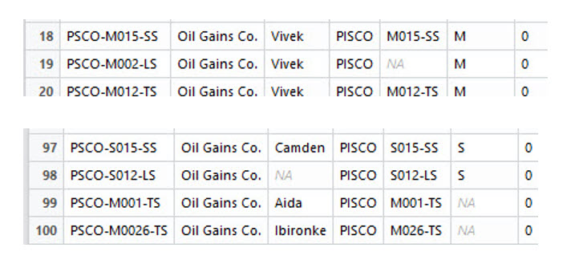

<!-- README.md is generated from README.Rmd. Please edit that file -->

```{r setup, include=F, error=T, message=F, warning=F}
knitr::opts_chunk$set(echo=T, comment=NA, error=T, warning=F, message = F, fig.align = 'center', collapse=FALSE)
```


## Load the raw data file

```{r}
# load the library xlsx
library(xlsx)

# read the raw data
myXl <- read.xlsx("../extdata/oilfield_100w_raw_data.xlsx", 
                  sheetIndex = 1, stringsAsFactors=FALSE)
```

## Mistyped data
One of the challenges in cleaning up well data is having uniform and standard well names. This becomes important at the time of classification, ranking and selection. An example of this is when looking for the **top 20** oil producers or wells with higher **watercut** or **GOR** or wells with highest or lowest gas injection rate **GLIR** (gas lift wells). If a well name is not correct you may encounter repeated occurrences of the well, a wrong classificatio, or a well that should have received attention but did not. Besides, how good an analysis can be if we start with typos in the well names, or the well everyone is expecting doesn't show up in the plot or summary?

One of the first things to do, if we are folowing a well name standard, internal or **API**, is finding if all the wells in the raw data file are compliant with that standard. One way of doing it is comparing the well names with a **pattern**. In R there are several functions that use patterns for name verification and correction. We will be using a few: `grep`, `grepl`, `gsub`, `gregexpr`, and couple more from the R package `stringr`.

Let's start then defining the pattern of a well name.

## Pattern detection
If we take a look at the well name in the picture at the top we see that the naming should follow these rules:

* the first 4 alphabetic characters represent the abbreviation of the field
* then , there is dash
* after the dash comes one character for the platform
* then 3 digits, from 000 to 999 that represent the well number
* then a dash
* and finally, two alphabetic characters for the completion type

So, there is a total of 10 significant identifiers plus 2 dashes.

If we use `regular expressions` or `regex` in its simplest form, the wells should follow this pattern:

           PSCO-[M,Q,R,S][0-9][0-9][0-9]-[T,L,S]S
   
```{r rows.print=15}
# using a template to find out which well names do not follow a pattern
  x       <- myXl$Wellname
  pattern <- "PSCO-[M,O,P,,Q,R,S][0-9][0-9][0-9]-[T,L,S]S"
  values  <- grep(pattern, x, value = TRUE, invert = TRUE)
  indices <- grep(pattern, x, invert = TRUE)
  data.frame(indices, values)
```


If we want to add another column for extra information just add the column with the indices

```{r rows.print=15}
# add a column using the indices
data.frame(indices, values, myXl$Platform[indices])
```


The result is that we get the observations (rows) that have incorrect well names. They are 11 instances.

This is much better than visually inspecting them in a spreadsheet, isn't it?

## What's wrong with this alphanumeric data?

What are the type of offences?

* Incorrect well number: `PSCO-M0007-TS`, `PSCO-M0026-TS`
* Platform omitted: `PSCO-027-TS`
* Platform in lowercase: `PSCO-r015-LS`, `PSCO-m016-LS`
* Incorrect field name: `PiSCO-R009-SS`, `PISCO-R027-LS`
* Incorrect completion type: `PSCO-R022-T`, `PSCO-Q019-L`, `PSCO-Q001-S`
* Extra spaces in the name: `PSCO-S019 -LS`
* Missing data: in the columns: see the **NA**s in the picture?

```{r, out.width = "400px", echo=F}

```

