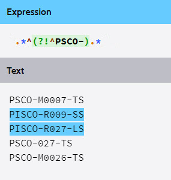
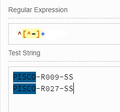
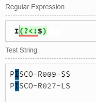
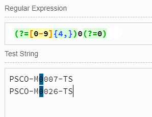
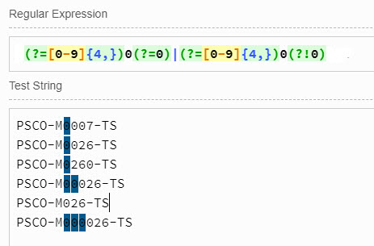
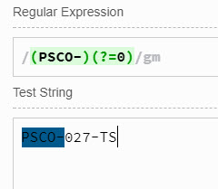
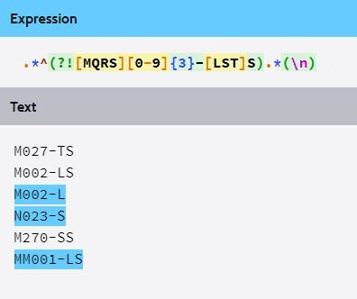
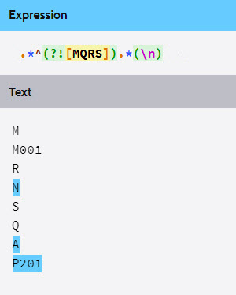

# Finding and filling missing well data: alphanumerics

<!-- README.md is generated from README.Rmd. Please edit that file -->


## Load the raw data file


```r
# load the library xlsx
library(xlsx)

# read the raw data
myXl <- read.xlsx("../extdata/oilfield_100w_raw_data.xlsx", 
                  sheetIndex = 1, stringsAsFactors=FALSE)
```


## Fix the well name
We will see that some well names can be fixed manually and others should be done automatically with a script.

In our particular case we only have 100 wells but what about if we have 1000, or 5000? Doing it manually is not an option. Some are quickly fixable some others are more challenging. Let's start by the easier ones.

> When correcting data, always go from the more general to the more particular.

### convert lowercase to uppercase
Let's convert the well names to uppercase and verify how many were corrected.


```r
# lowercase to uppercase
  myXl$Wellname <- toupper(myXl$Wellname)

# show the wells with issues
  x       <- myXl$Wellname
  pattern <- "PSCO-[M,O,P,,Q,R,S][0-9][0-9][0-9]-[T,L,S]S"
  indices <- grep(pattern, x, invert = TRUE)
  values  <- grep(pattern, x, value = TRUE, invert = TRUE)
  data.frame(indices, values)
#:>   indices        values
#:> 1       2 PSCO-M0007-TS
#:> 2      22   PSCO-Q001-S
#:> 3      30   PSCO-Q019-L
#:> 4      45 PISCO-R009-SS
#:> 5      66 PISCO-R027-LS
#:> 6      69   PSCO-R022-T
#:> 7      75   PSCO-027-TS
#:> 8      82 PSCO-S019 -LS
#:> 9     100 PSCO-M0026-TS
```

Two were corrected.

### removing spaces
Now, let's remove spaces from the well name.


```r
# removing spaces
  x         <- myXl$Wellname
  pattern   <- " "
  replaceBy <- ""
  myXl$Wellname <- gsub(pattern, replaceBy, x)

# show the wells with issues
  x       <- myXl$Wellname
  pattern <- "PSCO-[M,O,P,,Q,R,S][0-9][0-9][0-9]-[T,L,S]S"
  indices <- grep(pattern, x, invert = TRUE)
  values  <- grep(pattern, x, value = TRUE, invert = TRUE)
  data.frame(indices, values)  
#:>   indices        values
#:> 1       2 PSCO-M0007-TS
#:> 2      22   PSCO-Q001-S
#:> 3      30   PSCO-Q019-L
#:> 4      45 PISCO-R009-SS
#:> 5      66 PISCO-R027-LS
#:> 6      69   PSCO-R022-T
#:> 7      75   PSCO-027-TS
#:> 8     100 PSCO-M0026-TS
```

One well name was corrected.

### correct the `completion type`
The completion type, at the end of the well name, should have two characters: LS, TS or SS.


```r
# complete the completion type
# We have three completion type: SS, LS and TS

  myXl$Wellname <- gsub("-L$", "-LS", myXl$Wellname)  # the dollar sign at the end,  
  myXl$Wellname <- gsub("-S$", "-SS", myXl$Wellname)  #   means that we are checking 
  myXl$Wellname <- gsub("-T$", "-TS", myXl$Wellname)  #   at the end of the string

# show the wells with issues
  x       <- myXl$Wellname
  pattern <- "PSCO-[M,O,P,,Q,R,S][0-9][0-9][0-9]-[T,L,S]S"
  values  <- grep(pattern, x, value = TRUE, invert = TRUE)
  indices <- grep(pattern, x, invert = TRUE)
  data.frame(indices, values)
#:>   indices        values
#:> 1       2 PSCO-M0007-TS
#:> 2      45 PISCO-R009-SS
#:> 3      66 PISCO-R027-LS
#:> 4      75   PSCO-027-TS
#:> 5     100 PSCO-M0026-TS
```

Those were the easy ones. We had three corrections. There are 5 more to go.

### correcting the `field` in the well name
There are two wells that were not properly `field` identified.

We have an additional "I" in the field name abbreviation. We have to remove it.

At this point we have two choices: (1) change all the first 4 first characters to PSCO, or, (2) replace only those two well names with the issue by replacing the "I" with a blank.


```r
# detect well names that are not named as PSCO-
  x       <- myXl$Wellname
  pattern <- "^PSCO-"
  values  <- grep(pattern, x, value = TRUE, invert = TRUE)
  indices <- grep(pattern, x, invert = TRUE)
  data.frame(indices, values)
#:>   indices        values
#:> 1      45 PISCO-R009-SS
#:> 2      66 PISCO-R027-LS
```

#### Explanation of the regex `^PSCO-`
    `^`      start of the string
    `PSCO-`  characters that follow    
    
    
In the example we used `invert=TRUE` to negate the correct pattern. If we want the regex pattern including the negation we would have to use:



#### option (1): change all the first 4 first characters to PSCO


```r
# replace any characters before the first dash
  x       <- myXl$Wellname
  pattern <- "^[^-]+"
  replace <- "PSCO"

# replace on all the wells  
  myXl$Wellname <- gsub(pattern, replace, x, perl = TRUE)
```

   
#### Explanation of the regex `^[^-]+`
    ^     start of the string
    [^-]  negate the class dash  
    +     match at least one occurrence




#### option (2): replace only those two well names with the issue.


```r
# replace the letter "I" by a blank
  x       <- myXl$Wellname
  pattern <- "I(?<!S)"
  replaceBy <- ""                      # replace by a blank

# replace on indexed wells
  myXl$Wellname[indices]
  myXl$Wellname[indices] <- gsub(pattern, replaceBy, x[indices], perl = TRUE)
  myXl$Wellname[indices]
#:> [1] "PSCO-R009-SS" "PSCO-R027-LS"
#:> [1] "PSCO-R009-SS" "PSCO-R027-LS"
```

#### Explanation of the regex `I(?<!S)`
    I       match the "I"
    (?<!S)  stop at the "I"" back from "S" 
    




### correct the length of the `well number`
The well names have been corrected on the field identifier.
Next if correcting the length of the well number.


```r
# show the wells with issues
  x       <- myXl$Wellname
  pattern <- "PSCO-[M,O,P,,Q,R,S][0-9][0-9][0-9]-[T,L,S]S"
  values  <- grep(pattern, x, value = TRUE, invert = TRUE)
  indices <- grep(pattern, x, invert = TRUE)
  data.frame(indices, values, platform = myXl$Platform[indices])
#:>   indices        values platform
#:> 1       2 PSCO-M0007-TS        M
#:> 2      75   PSCO-027-TS        S
#:> 3     100 PSCO-M0026-TS     <NA>
```


Alright. So far, we have corrected the field name in the well name. 
There are still three more wells to go which problems are:

    PSCO-M0007-TS  long well number. It should be maximum of 3 digits
    PSCO-027-TS    missing platform number
    PSCO-M0026-TS  long well number. It should be maximum of 3 digits


The well number should go from `000` to `999`, right after the field identifier (one character)


```r
# take a look at the wells that have longer digits
  x       <- myXl$Wellname
  pattern <- "(?=[0-9]{4,})0(?=0)" 
  
  values  <- grep(pattern, x, value = TRUE, perl = TRUE)
  indices <- grep(pattern, x, perl = TRUE)
  data.frame(indices, values)
#:>   indices        values
#:> 1       2 PSCO-M0007-TS
#:> 2     100 PSCO-M0026-TS
```


See what we are going to replace:


```r
# what the pattern has detected is one zero at position 7, right after the field
  gregexpr(pattern, values, perl = TRUE)
#:> [[1]]
#:> [1] 7
#:> attr(,"match.length")
#:> [1] 1
#:> attr(,"useBytes")
#:> [1] TRUE
#:> 
#:> [[2]]
#:> [1] 7
#:> attr(,"match.length")
#:> [1] 1
#:> attr(,"useBytes")
#:> [1] TRUE
```


```r
# replace well numbers that are long
x         <- myXl$Wellname
pattern   <-  "(?=[0-9]{4,})0(?=0)"      
replaceBy <-  ""                         # replace by a blank

myXl$Wellname[indices] <- gsub(pattern, replaceBy, x[indices], perl = TRUE)
```


```r
# show the wells with issues
  x <- myXl$Wellname
  pattern <- "PSCO-[M,O,P,,Q,R,S][0-9][0-9][0-9]-[T,L,S]S"
  values  <- grep(pattern, x, value = TRUE, invert = TRUE)
  indices <- grep(pattern, x, invert = TRUE)
  data.frame(indices, values)
#:>   indices      values
#:> 1      75 PSCO-027-TS
```

Very good. Now we have one well left.   

#### Explanation of the regex `(?=[0-9]{4,})0(?=0)`
    (?=[0-9]{4,})   match numbers that are longer or equal to 4
    (?<!S)          stop at the "I"" back from "S" 
    



If we had longer numbers we would modify the regex to:



See in this example that as more zeros show up in the number (last line), those zeros are removed from the string to fit the 3 digit number limit.


### Add the one-letter `platform identifier` to the well name


```r
# take a look at the wells 
  x <- myXl$Wellname
  pattern = "(PSCO-)(?=0)" 
  
  values  <- grep(pattern, x, value = TRUE, perl = TRUE)
  indices <- grep(pattern, x, perl = TRUE)
  data.frame(indices, values, platform = myXl$Platform[indices])
#:>   indices      values platform
#:> 1      75 PSCO-027-TS        S
```
   
   
#### Explanation of the regex `(PSCO-)(?=0)`
    (PSCO-)   group "PSCO-""
    (?=0)     look ahead the "0" 
    




```r
# replace the "I" by a blank
  x         <- myXl$Wellname
  pattern   <-  "(PSCO-)(?=0)"
  replaceBy <- paste0("\\1", myXl$Platform[[indices]])   # concatenate the platform
  
  myXl$Wellname[indices]  # before
  myXl$Wellname[indices]  <- gsub(pattern, replaceBy, x[indices], perl = TRUE)
  myXl$Wellname[indices]  # after
#:> [1] "PSCO-027-TS"
#:> [1] "PSCO-S027-TS"
```

Well names are done! Let's take a look:


```r
# print the well names
myXl$Wellname
#:>   [1] "PSCO-M005-TS" "PSCO-M007-TS" "PSCO-M004-LS" "PSCO-M008-TS"
#:>   [5] "PSCO-M010-SS" "PSCO-M006-TS" "PSCO-M016-LS" "PSCO-M018-LS"
#:>   [9] "PSCO-M021-LS" "PSCO-M017-LS" "PSCO-M030-SS" "PSCO-M027-SS"
#:>  [13] "PSCO-M016-SS" "PSCO-M020-LS" "PSCO-M028-TS" "PSCO-M015-LS"
#:>  [17] "PSCO-M018-SS" "PSCO-M015-SS" "PSCO-M002-LS" "PSCO-M012-TS"
#:>  [21] "PSCO-Q007-LS" "PSCO-Q001-SS" "PSCO-Q005-SS" "PSCO-Q011-SS"
#:>  [25] "PSCO-Q002-SS" "PSCO-Q002-LS" "PSCO-Q003-LS" "PSCO-Q004-SS"
#:>  [29] "PSCO-Q009-SS" "PSCO-Q019-LS" "PSCO-Q032-SS" "PSCO-Q028-LS"
#:>  [33] "PSCO-Q028-SS" "PSCO-Q029-LS" "PSCO-Q032-LS" "PSCO-Q024-TS"
#:>  [37] "PSCO-Q018-LS" "PSCO-Q017-LS" "PSCO-Q013-SS" "PSCO-Q014-LS"
#:>  [41] "PSCO-Q017-SS" "PSCO-Q014-SS" "PSCO-Q018-SS" "PSCO-Q012-TS"
#:>  [45] "PSCO-R009-SS" "PSCO-R015-LS" "PSCO-R019-SS" "PSCO-R019-LS"
#:>  [49] "PSCO-R020-SS" "PSCO-R013-TS" "PSCO-R012-LS" "PSCO-R012-SS"
#:>  [53] "PSCO-R018-SS" "PSCO-R018-LS" "PSCO-R015-SS" "PSCO-R020-SS"
#:>  [57] "PSCO-R004-LS" "PSCO-R001-SS" "PSCO-R003-TS" "PSCO-R006-SS"
#:>  [61] "PSCO-R007-LS" "PSCO-R001-LS" "PSCO-R007-SS" "PSCO-R002-SS"
#:>  [65] "PSCO-R029-TS" "PSCO-R027-LS" "PSCO-R025-SS" "PSCO-R023-SS"
#:>  [69] "PSCO-R022-TS" "PSCO-R021-SS" "PSCO-R023-LS" "PSCO-R027-SS"
#:>  [73] "PSCO-S008-LS" "PSCO-S004-LS" "PSCO-S027-TS" "PSCO-S019-SS"
#:>  [77] "PSCO-S007-LS" "PSCO-S011-SS" "PSCO-S016-LS" "PSCO-S002-TS"
#:>  [81] "PSCO-S002-TS" "PSCO-S019-LS" "PSCO-S030-SS" "PSCO-S018-LS"
#:>  [85] "PSCO-S026-SS" "PSCO-S029-TS" "PSCO-S018-SS" "PSCO-S013-SS"
#:>  [89] "PSCO-S015-LS" "PSCO-S031-TS" "PSCO-S032-SS" "PSCO-S030-LS"
#:>  [93] "PSCO-S032-LS" "PSCO-S006-SS" "PSCO-S021-TS" "PSCO-S016-SS"
#:>  [97] "PSCO-S015-SS" "PSCO-S012-LS" "PSCO-M001-TS" "PSCO-M026-TS"
```


## Check if `Company` is correct
The next variable or column is the "Company". It should be easy.


```r

x        <- myXl$Company
patttern <- "Oil Gains Co."

grep(pattern, x, value = TRUE, perl = TRUE)
# We don't get any return. All the company names are the same. Cool!
#:> character(0)
```

We don't get any return. All the company names are the same. Cool!


## Detect incorrect names and synonyms in `Analyst`
The could use this variable to store the name of the analyst or the operator who supplied the data.


```r
# summary(myXl$Analyst)
unique(myXl$Analyst)             # show only non-repeating names
#:>  [1] "Aida"     "Ibironke" "Ibironk"  "Vivek"    "Americo"  "Norman"  
#:>  [7] "Rod"      "Rodrigo"  "Sam"      "Thomas"   "Tom"      "Kai"     
#:> [13] "Andrew"   "Andy"     "Camden"   NA
length(unique(myXl$Analyst))     # how many
#:> [1] 16
```


```r
operators <- c("Aida", "Americo", "Andrew", "Camden", "Ibironke", "Kai", "Norman", 
               "Rodrigo", "Sam", "Tom", "Vivek")

# find incorrect assignments
  x       <- myXl$Analyst
  indices <- which(!x %in% operators)
  result  <- myXl$Analyst[indices]
  data.frame(indices, result)
#:>   indices  result
#:> 1       9 Ibironk
#:> 2      31     Rod
#:> 3      32     Rod
#:> 4      33     Rod
#:> 5      37  Thomas
#:> 6      78    Andy
#:> 7      83    Andy
#:> 8      98    <NA>
```

We can correct manually. 
In this example we will make use of the operator `%in%`. It is pretty handy for checking if elements belong to a particular group.


```r
# assigning via indices
myXl$Analyst[9]              <- "Ibironke" 
myXl$Analyst[c(31,32,32,33)] <- "Rodrigo"
myXl$Analyst[c(78,83)]       <- "Andrew"
myXl$Analyst[c(37)]          <- "Tom"

# verify if we have incorrect assignements
  myXl$Analyst[indices]
#:> [1] "Ibironke" "Rodrigo"  "Rodrigo"  "Rodrigo"  "Tom"      "Andrew"  
#:> [7] "Andrew"   NA
  indices <- which(!myXl$Analyst %in% operators)
  myXl$Analyst[indices]
#:> [1] NA
```

There is only one observation left, the one with NA.
We will have to cross-reference it.
Let's find out who are the platform operators.

### Who is the platform operator?
In our particular case, who is the platform operator in "S"?

```r
# Who is the platform operator?
  table(myXl$Analyst, myXl$Platform)
#:>           
#:>             M  Q  R  S
#:>   Aida      6  0  1  0
#:>   Americo   0  6  0  0
#:>   Andrew    0  0  0 11
#:>   Camden    0  0  0 14
#:>   Ibironke  9  2  0  0
#:>   Kai       0  0  8  0
#:>   Norman    0  1  8  0
#:>   Rodrigo   0  5  0  0
#:>   Sam       0  1  0  0
#:>   Tom       0  8  0  0
#:>   Vivek     5  1 11  0
```

For platform S, it could be Andrew or Camden.


```r
# which observations are and are not "Andrew" and "Camden"
  myXl$Analyst %in% c("Andrew", "Camden")
#:>   [1] FALSE FALSE FALSE FALSE FALSE FALSE FALSE FALSE FALSE FALSE FALSE
#:>  [12] FALSE FALSE FALSE FALSE FALSE FALSE FALSE FALSE FALSE FALSE FALSE
#:>  [23] FALSE FALSE FALSE FALSE FALSE FALSE FALSE FALSE FALSE FALSE FALSE
#:>  [34] FALSE FALSE FALSE FALSE FALSE FALSE FALSE FALSE FALSE FALSE FALSE
#:>  [45] FALSE FALSE FALSE FALSE FALSE FALSE FALSE FALSE FALSE FALSE FALSE
#:>  [56] FALSE FALSE FALSE FALSE FALSE FALSE FALSE FALSE FALSE FALSE FALSE
#:>  [67] FALSE FALSE FALSE FALSE FALSE FALSE  TRUE  TRUE  TRUE  TRUE  TRUE
#:>  [78]  TRUE  TRUE  TRUE  TRUE  TRUE  TRUE  TRUE  TRUE  TRUE  TRUE  TRUE
#:>  [89]  TRUE  TRUE  TRUE  TRUE  TRUE  TRUE  TRUE  TRUE  TRUE FALSE FALSE
#:> [100] FALSE

# which indices contain "Andrew" and "Camden"
  mask <- which(myXl$Analyst %in% c("Andrew", "Camden"))
  mask
#:>  [1] 73 74 75 76 77 78 79 80 81 82 83 84 85 86 87 88 89 90 91 92 93 94 95
#:> [24] 96 97
  
# show the well name, analyst and platform  
  myXl[mask, c("Wellname", "Analyst", "Platform")]  
#:>        Wellname Analyst Platform
#:> 73 PSCO-S008-LS  Andrew        S
#:> 74 PSCO-S004-LS  Andrew        S
#:> 75 PSCO-S027-TS  Andrew        S
#:> 76 PSCO-S019-SS  Andrew        S
#:> 77 PSCO-S007-LS  Andrew        S
#:> 78 PSCO-S011-SS  Andrew        S
#:> 79 PSCO-S016-LS  Andrew        S
#:> 80 PSCO-S002-TS  Andrew        S
#:> 81 PSCO-S002-TS  Andrew        S
#:> 82 PSCO-S019-LS  Andrew        S
#:> 83 PSCO-S030-SS  Andrew        S
#:> 84 PSCO-S018-LS  Camden        S
#:> 85 PSCO-S026-SS  Camden        S
#:> 86 PSCO-S029-TS  Camden        S
#:> 87 PSCO-S018-SS  Camden        S
#:> 88 PSCO-S013-SS  Camden        S
#:> 89 PSCO-S015-LS  Camden        S
#:> 90 PSCO-S031-TS  Camden        S
#:> 91 PSCO-S032-SS  Camden        S
#:> 92 PSCO-S030-LS  Camden        S
#:> 93 PSCO-S032-LS  Camden        S
#:> 94 PSCO-S006-SS  Camden        S
#:> 95 PSCO-S021-TS  Camden        S
#:> 96 PSCO-S016-SS  Camden        S
#:> 97 PSCO-S015-SS  Camden        S
```

There is not a real pattern here. We will assign the well to Andrew, make a note. Then we make a call to the field to confirm.

In this example we use the function `which`, another powerful feature of R. It returns the index numbers of those observations that match or do not match a logical condition. Then with the index numbers you extract the observations from the vector, dataframe or matrix.


```r
myXl$Analyst[c(98)] = "Andrew"

# verify if we have incorrect assignements
  tocorrectIndices <- which(!myXl$Analyst %in% operators)
  myXl[tocorrectIndices, ]
#:>  [1] Wellname          Company           Analyst          
#:>  [4] Field             Location          Platform         
#:>  [7] Fluid             WellType          AL_Method        
#:> [10] Completion        SandControl       WT_COUNT         
#:> [13] PVT_GOR           PVT_API           PVT_SG_gas       
#:> [16] PVT_WaterSalinity PVT_H2S           PVT_CO2          
#:> [19] PVT_PB_CORR       PVT_VISC_CORR     PVT_BPTEMP       
#:> [22] PVT_BPPRES        VLP_CORR          IPR_CORR         
#:> [25] IPR_RESPRES       IPR_RESTEMP       IPR_TOTGOR       
#:> [28] IPR_WC            IPR_VOGELRT       IPR_VOGELPRES    
#:> [31] IPR_PI            GEO_THMD          GEO_THTEMP       
#:> [34] GL_method         GL_ArrayMandrels  GL_Vdepth        
#:> [37] GL_GSG            GL_CO2            WT_DATE          
#:> [40] WT_THT            WT_LIQRT          WT_WC            
#:> [43] WT_THP            WT_GOR            WT_GLIR          
#:> [46] WT_DEPTH          WT_Enable         WT_GDEPTH        
#:> [49] WT_GPRES          WT_RESPRES        ProsperFilename  
#:> <0 rows> (or 0-length row.names)

  # Analyst is complete  
```


## Find and replace incorrect and missing values in `Field`


```r
unique(myXl$Field)
#:> [1] "PISCO" NA      "pisco"
# we have two additional keywords for the field that have to be corrected.
# let's find out what indices they have
```


```r
# verify for bad names in field
indices <- grep("[^PISCO]", myXl$Field)      # which means those which are not named like PISCO
result <-  grep("[^PISCO]", myXl$Field, value = TRUE)
df1 <- data.frame(indices, result)
df1
#:>   indices result
#:> 1      12  pisco
#:> 2      27  pisco
```


```r
# which row index has NAs in it
indices  <- which(is.na(myXl$Field))
result   <- myXl$Field[indices]
df2      <- data.frame(indices, result)
df2
#:>   indices result
#:> 1       7   <NA>
```


```r
# combine both data frames
rbind(df1, df2)
#:>   indices result
#:> 1      12  pisco
#:> 2      27  pisco
#:> 3       7   <NA>
```


```r
# make the correction
myXl$Field[c(7,12,27)] <- "PISCO"

# verify for bad names in field
  grep("[^PISCO]", myXl$Field)    # which means those which are not named like PISCO
#:> integer(0)
  
# which row index has NAs in it
  which(is.na(myXl$Field))
#:> integer(0)
  
# it has been fixed now  
```


## Add a column for the `Completion` type
To close this chapter, let's add a new variable (column) where we have only the **Completion Type**.
We can take advantage that the last two characters of the well name is the completion type.

We introduce here another function `nchar` which returns the number of characters of a string of text. The second function is `substr`.

    nchar(x)   number of character of the string
    
    substr(x, start, end)  extract/replace a string from start to end


```r
# extract the last two characters of "Wellname""
  substr(myXl$Wellname, nchar(myXl$Wellname)-1, nchar(myXl$Wellname))
#:>   [1] "TS" "TS" "LS" "TS" "SS" "TS" "LS" "LS" "LS" "LS" "SS" "SS" "SS" "LS"
#:>  [15] "TS" "LS" "SS" "SS" "LS" "TS" "LS" "SS" "SS" "SS" "SS" "LS" "LS" "SS"
#:>  [29] "SS" "LS" "SS" "LS" "SS" "LS" "LS" "TS" "LS" "LS" "SS" "LS" "SS" "SS"
#:>  [43] "SS" "TS" "SS" "LS" "SS" "LS" "SS" "TS" "LS" "SS" "SS" "LS" "SS" "SS"
#:>  [57] "LS" "SS" "TS" "SS" "LS" "LS" "SS" "SS" "TS" "LS" "SS" "SS" "TS" "SS"
#:>  [71] "LS" "SS" "LS" "LS" "TS" "SS" "LS" "SS" "LS" "TS" "TS" "LS" "SS" "LS"
#:>  [85] "SS" "TS" "SS" "SS" "LS" "TS" "SS" "LS" "LS" "SS" "TS" "SS" "SS" "LS"
#:>  [99] "TS" "TS"
```


```r
# assign the completion type to a new column
  myXl$Completion <- substr(myXl$Wellname, 
                            nchar(myXl$Wellname)-1, 
                            nchar(myXl$Wellname))
  myXl$Completion
#:>   [1] "TS" "TS" "LS" "TS" "SS" "TS" "LS" "LS" "LS" "LS" "SS" "SS" "SS" "LS"
#:>  [15] "TS" "LS" "SS" "SS" "LS" "TS" "LS" "SS" "SS" "SS" "SS" "LS" "LS" "SS"
#:>  [29] "SS" "LS" "SS" "LS" "SS" "LS" "LS" "TS" "LS" "LS" "SS" "LS" "SS" "SS"
#:>  [43] "SS" "TS" "SS" "LS" "SS" "LS" "SS" "TS" "LS" "SS" "SS" "LS" "SS" "SS"
#:>  [57] "LS" "SS" "TS" "SS" "LS" "LS" "SS" "SS" "TS" "LS" "SS" "SS" "TS" "SS"
#:>  [71] "LS" "SS" "LS" "LS" "TS" "SS" "LS" "SS" "LS" "TS" "TS" "LS" "SS" "LS"
#:>  [85] "SS" "TS" "SS" "SS" "LS" "TS" "SS" "LS" "LS" "SS" "TS" "SS" "SS" "LS"
#:>  [99] "TS" "TS"
```

## Replace values in `Location`


```r
myXl$Location
#:>   [1] "M005-TS" "M007-TS" "M004-LS" "M008-TS" "M010-SS" "M006-TS" "M016-LS"
#:>   [8] "M018-LS" "M021-LS" "M017-LS" "M030-SS" "M027-SS" "M016-SS" "M020-LS"
#:>  [15] "M028-TS" "M015-LS" "M018-SS" "M015-SS" NA        "M012-TS" "Q007-LS"
#:>  [22] "Q001-SS" "Q005-SS" "Q011-SS" "Q002-SS" "Q002-LS" "Q003-LS" "Q004-SS"
#:>  [29] "Q009-SS" "Q019-LS" "Q032-SS" "Q028-LS" "Q028-SS" "Q029-LS" "Q032-LS"
#:>  [36] "Q024-TS" "Q018-LS" "Q017-LS" "Q013-SS" "Q014-LS" "Q017-SS" "Q014-SS"
#:>  [43] "Q018-SS" "Q012-TS" "R009-SS" "R015-LS" "R019-SS" "R019-LS" "R020-SS"
#:>  [50] "R013-TS" "R012-LS" "R012-SS" "R018-SS" "R018-LS" "R015-SS" "R020-SS"
#:>  [57] "R004-LS" "R001-SS" "R003-TS" "R006-SS" "R007-LS" "R001-LS" "R007-SS"
#:>  [64] "R002-SS" "R029-TS" "R027-LS" "R025-SS" "R023-SS" "R022-TS" "R021-SS"
#:>  [71] "R023-LS" "R027-SS" "S008-LS" "S004-LS" "S027-TS" "S019-SS" "S007-LS"
#:>  [78] "S011-SS" "S016-LS" "S002-TS" "S002-TS" "S019-LS" "S030-SS" "S018-LS"
#:>  [85] "S026-SS" "S029-TS" "S018-SS" "S013-SS" "S015-LS" "S031-TS" "S032-SS"
#:>  [92] "S030-LS" "S032-LS" "S006-SS" "S021-TS" "S016-SS" "S015-SS" "S012-LS"
#:>  [99] "M001-TS" "M026-TS"
```


Observe that in this example we are using the pattern `[MQRS][0-9]{3}-[LTS]S` together with the parameter `invert=TRUE` in `grep`. This means that the pattern will be negated when `invert` is `TRUE`.


```r
# we can test it by not following pattern or those which are NA
pattern <- "[MQRS][0-9]{3}-[LTS]S"

# test that Location follows the pattern
indices <- grep(pattern, myXl$Location, invert = TRUE)
myXl$Location[indices]

data.frame(indices, myXl$Wellname[indices], myXl$Location[indices])
# there is one non-compliant index 
# which matches what we see above
#:> [1] NA
#:>   indices myXl.Wellname.indices. myXl.Location.indices.
#:> 1      19           PSCO-M002-LS                   <NA>
```

If we would like instead is the regex for the negated pattern it would have to look like this:



You see that the words matched are those which do not match the correct pattern.


```r
myXl$Location[indices]  # before
#:> [1] NA

# assign the extracted string to "Location"
  myXl$Location[indices] <- substr(myXl$Wellname[indices], 
                                  nchar(myXl$Wellname[indices])-6, 
                                  nchar(myXl$Wellname[indices]))
myXl$Location[indices]  # after
#:> [1] "M002-LS"
myXl$Location
#:>   [1] "M005-TS" "M007-TS" "M004-LS" "M008-TS" "M010-SS" "M006-TS" "M016-LS"
#:>   [8] "M018-LS" "M021-LS" "M017-LS" "M030-SS" "M027-SS" "M016-SS" "M020-LS"
#:>  [15] "M028-TS" "M015-LS" "M018-SS" "M015-SS" "M002-LS" "M012-TS" "Q007-LS"
#:>  [22] "Q001-SS" "Q005-SS" "Q011-SS" "Q002-SS" "Q002-LS" "Q003-LS" "Q004-SS"
#:>  [29] "Q009-SS" "Q019-LS" "Q032-SS" "Q028-LS" "Q028-SS" "Q029-LS" "Q032-LS"
#:>  [36] "Q024-TS" "Q018-LS" "Q017-LS" "Q013-SS" "Q014-LS" "Q017-SS" "Q014-SS"
#:>  [43] "Q018-SS" "Q012-TS" "R009-SS" "R015-LS" "R019-SS" "R019-LS" "R020-SS"
#:>  [50] "R013-TS" "R012-LS" "R012-SS" "R018-SS" "R018-LS" "R015-SS" "R020-SS"
#:>  [57] "R004-LS" "R001-SS" "R003-TS" "R006-SS" "R007-LS" "R001-LS" "R007-SS"
#:>  [64] "R002-SS" "R029-TS" "R027-LS" "R025-SS" "R023-SS" "R022-TS" "R021-SS"
#:>  [71] "R023-LS" "R027-SS" "S008-LS" "S004-LS" "S027-TS" "S019-SS" "S007-LS"
#:>  [78] "S011-SS" "S016-LS" "S002-TS" "S002-TS" "S019-LS" "S030-SS" "S018-LS"
#:>  [85] "S026-SS" "S029-TS" "S018-SS" "S013-SS" "S015-LS" "S031-TS" "S032-SS"
#:>  [92] "S030-LS" "S032-LS" "S006-SS" "S021-TS" "S016-SS" "S015-SS" "S012-LS"
#:>  [99] "M001-TS" "M026-TS"
```


```r
# test that "Location"" follows the pattern
grep(pattern, myXl$Location, invert = TRUE)
#:> integer(0)
# we are done here
```


## Replace NA values in `Platform`


```r
# verify which indices do not comply the platform letters
x       <- myXl$Platform
pattern <- "[MQRS]"

indices <- grep(pattern, x, invert = TRUE)
values  <- grep(pattern, x, invert = TRUE, value = TRUE)
data.frame(indices, values, myXl$Wellname[indices])
#:>   indices values myXl.Wellname.indices.
#:> 1      99   <NA>           PSCO-M001-TS
#:> 2     100   <NA>           PSCO-M026-TS
# only two not following
# since the well name is already corrected, let's use it
```

Again, if instead of using `invert=TRUE` in grep we could have used the negation of the pattern which is:



What this regex does is match those words that do not contain a valid platform character.


```r
# extract the platform from the well name
  myXl$Platform <- substr(myXl$Wellname, 
                        nchar(myXl$Wellname)-6, nchar(myXl$Wellname)-6)

# verify which indices do not comply the platform name
  grep("[MQRS]", myXl$Platform, invert = TRUE)
#:> integer(0)
# we are done here
```

